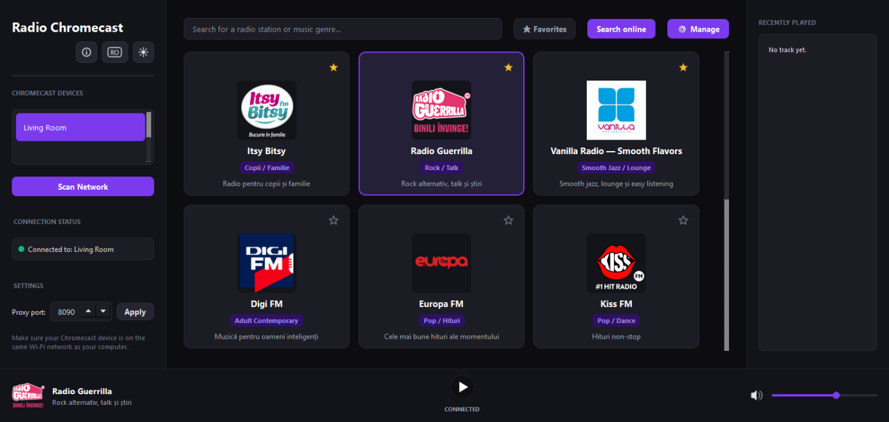
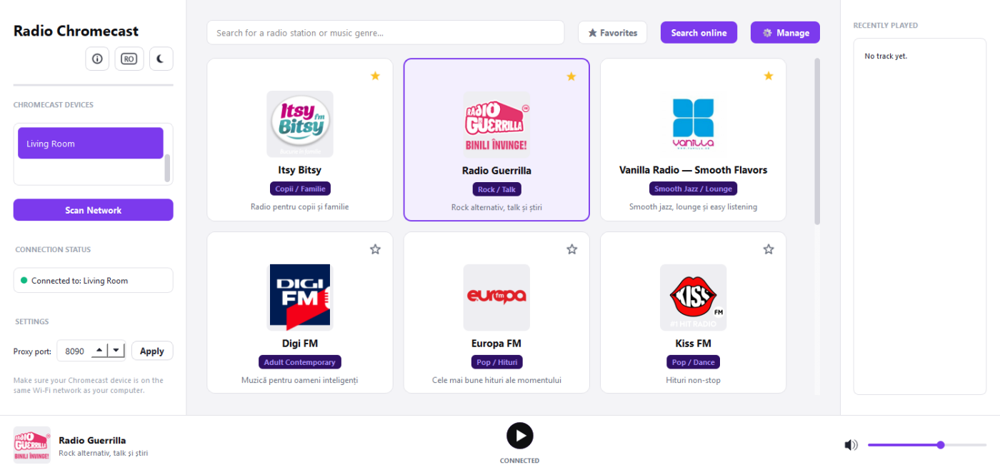
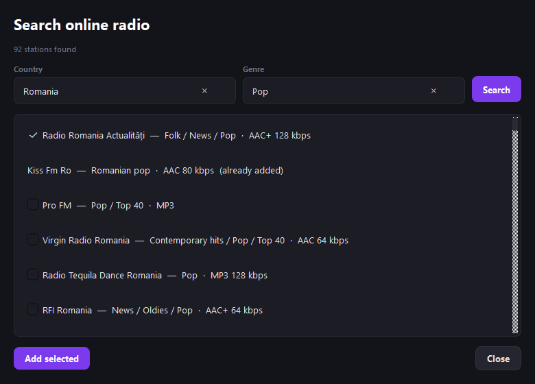

# RadioChromecast

RadioChromecast is a desktop app that plays internet radio on Chromecast devices on the same network. It keeps a local station list, can search the public [Radio Browser](https://www.radio-browser.info/) directory, and shows the current track when the stream provides it.

The interface is available in English and Romanian, with a light and a dark theme.

## Interface

The main window lists your stations, the Chromecast devices on the network, and the playback controls.



The same window in the light theme:



Search online radio by country and genre, then add the stations you want:



## Features

- Discover Chromecast devices on the local network and reconnect to the last one
- Play, stop, and control volume from the app
- Search the station list by name or genre, and mark favorites
- Add, edit, and delete stations
- Search online stations by country and genre, then add the ones you want
- Show now-playing metadata and a recently played list
- Route difficult streams through a local proxy so Chromecast can play them
- Keep running in the notification area

## Requirements

- Windows
- Python 3.10 or newer
- A Chromecast (or Cast-enabled speaker) on the same Wi-Fi network as the computer

Python packages are listed in `requirements.txt`:

- PyQt6
- pychromecast
- requests
- PyInstaller (only needed to build the executable)

## Run from source

From the project folder:

```bat
py -3 -m venv .venv
.venv\Scripts\activate
python -m pip install -r requirements.txt
python src\main.py
```

On first launch the app creates `config.json` next to the project (or next to the executable, if you run a build). That file stores the theme, language, favorites, proxy port, and the last device. It is not part of the git repository.

## Build a Windows executable

`build.bat` creates a virtual environment if needed, installs dependencies, and runs PyInstaller:

```bat
build.bat
```

The executable is written to `dist\RadioChromecast.exe`. The script also copies `stations.json` beside it. `config.json` and the log file are created in that same folder when you start the app.

## Network and firewall

The computer and the Chromecast must be on the same network. Some stations are sent to the device as a direct URL. Others are marked with `"proxy": true` and are relayed by a small HTTP server on this computer (port **8090** by default). Chromecast has to be able to reach that port.

If playback stops immediately, Windows Firewall is a common cause. Run `fix-firewall.bat` as administrator. It allows `RadioChromecast.exe` and inbound TCP on port 8090 for private and domain networks. You can change the proxy port in the app; if you do, update the firewall rule to match.

## Station list

Stations live in `stations.json` in the project root (or beside the executable). Each entry looks like this:

```json
{
  "id": "example-fm",
  "name": "Example FM",
  "description": "A short description",
  "genre": "Pop",
  "url": "https://example.com/stream",
  "logo": "https://example.com/logo.png",
  "content_type": "audio/mpeg",
  "proxy": false
}
```

`name` and `url` are required. Set `proxy` to `true` when the stream must be relayed through this computer. `content_type` is usually `audio/mpeg` or `audio/aac`. `logo` may be `null`.

Changes made in the station manager are saved back to this file.

## Languages

Use the language button in the header to switch between Romanian and English. The choice is saved in `config.json`.
